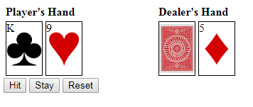

# BlackJack Game in JavaScript

This is the BlackJack game implemented in HTML/CSS/JavaScript with tests written in QUnit.

The player has a hand of 2 starting cards, both face up.  The dealer starts with 2 cards as well, 1 face down and the other face up.  The object is to have the sum of the card values be as close to 21 as possible without going over 21.  An ace can be a 1 or an 11.  All face cards are 10.  If the player or the dealer is dealt 21 on the first two cards (an ace and a 10-value card), that player immediately wins.  The player can choose to add a card to their hand ("hit"), possibly risking going over 21.  Once the player decides to keep the hand ("stay"), the dealer will play by the same rules, and then the hands are compared.  The dealer wins ties.  Otherwise, the highest total hand value that does not exceed 21 wins.

## Running the Game

Clone the repository, then double-click on the `index.html` file.

## Running the Unit Tests

Clone the repository, then double-click on the `tests.html` file.

## Supported Browsers

* Chrome
* Firefox
* Internet Explorer 11